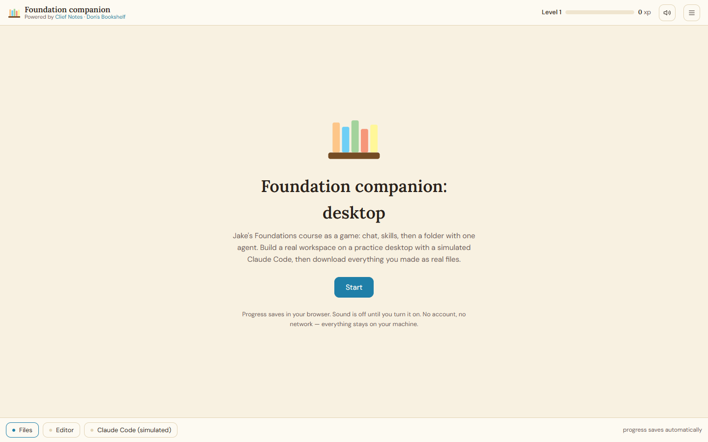

# Foundation Companion

Foundation Companion walks you through Jake Van Clief's Foundations course from the [Clief Notes Skool community](https://www.skool.com/cliefnotes/about?ref=f4482ac988fb4a7b8da3efa95cfc1d00) by having you build each lesson in Claude Code as you go. Instead of reading, you do.

For Clief Notes members who've seen the Foundations lessons and want a hands-on walkthrough. Updated for the October 2026 Foundations course (Start Here plus lessons 1.1 to 3.3), which is also free as one video: [How I'd Learn AI From Zero in 2026](https://youtu.be/6AzLk2-kWyY).

---

## What you'll walk away with

- **The three layers:** chat, skills, and folders with one agent, and when to use each.
- **Your first skill,** made from your own corrections, if you start at 1.1.
- **A real workspace** built around one of your own jobs: a short map with a routing table, your skill wired in, work split into stages you can step into, one steady step turned into a script, and an archive that keeps it from turning into a swamp.
- The habit behind all of it: one short sentence kicks off real work, and every piece of it sits in files you can open.

---

## Where it starts

This repo runs inside Claude Code, a coding environment, so **1.3 Folders and One Agent is the natural place to start.** That's where the AI starts working inside your files.

1.3 builds on the first two lessons, a list of corrections from a chat (1.1) and a skill made from them (1.2). If you haven't done those yet, the tutor walks you through them first. They happen in the Claude chat app, and the tutor keeps track of everything here.

---

## How it works: two windows

From 1.3 on you'll have two Claude Code sessions open:

- **The tutor,** opened on this folder. It teaches, gives you one step at a time, and checks your files.
- **The work session,** opened on your workspace folder (for example `client-email/`). That's the "one agent" from Jake's lessons. You give it the short requests and watch what it reads.

Jake's tests only mean something in a fresh session that knows nothing but your folder, so the tutor never does them for you. It checks what the work session made.

No folder of real work handy? `practice/` holds Jake's own practice folders, the exact ones from the lesson videos: a client-email folder, a tiny-test folder, a weekly bookings report, and a deliberately messy newsletter folder. The tutor copies out the one each lesson needs, so the originals stay clean.

---

## What you need first

- A **Claude Pro or Max** account. The free plan covers 1.1 and 1.2 in the chat app, but Claude Code needs a paid plan.
- **Claude Code** installed on your machine. (On the ChatGPT side, Codex works too: this repo ships an `AGENTS.md`.)

---

## Install steps (checked 6 October 2026)

These change often. If a step doesn't match your screen, the official [setup page](https://code.claude.com/docs/en/setup) wins.

**Claude desktop app (easiest):** download it from [claude.ai/download](https://claude.ai/download), sign in, and use the **Code** tab. Code needs a Pro, Max, Team or Enterprise plan.

**Claude Code in a terminal or editor:**

- macOS: `curl -fsSL https://claude.ai/install.sh | bash`
- Windows (PowerShell): `irm https://claude.ai/install.ps1 | iex`

No Node needed. Check it worked with `claude --version`. If `claude` isn't found, close the terminal completely and reopen it. There's also a VS Code extension, which works in Cursor too.

---

## How to open this repo

First, get the repo. Either clone it with git (`git clone https://github.com/donroy26/ICM-Foundations-Tutor.git`) or download the ZIP from GitHub and unzip it somewhere you can find it.

Then open it, whichever way you work:

**Claude desktop app:** Code tab, then Local, then select the Foundation Companion folder. Say "hi" or "let's go."

**VS Code:** File, then Open Folder, and select the Foundation Companion folder. Open the Claude Code panel. Say "hi" or "let's go."

**Terminal:** `cd` into the Foundation Companion folder, type `claude`, press Enter. Say "hi" or "let's go."

Claude reads the project files on start and handles everything from there. When a lesson needs the work session, the tutor tells you exactly how to open it.

---

## Time estimate

The tutor asks you to start a fresh session at the end of each section. Starting clean is part of the learning: it's the desk from 1.1.

| Session | Lessons | Rough time |
|---------|---------|------------|
| Session 1 | Start Here, 1.1, 1.2 (in the chat app) | 45 to 60 minutes |
| Session 2 | 1.3, 1.4 | 60 to 75 minutes |
| Session 3 | 2.1, 2.2, 2.3 | 75 to 90 minutes |
| Session 4 | 3.1, 3.2, 3.3 | 75 to 90 minutes |

Starting at 1.3? Skip session 1 and do Start Here at the top of session 2.

These are real estimates, not aspirational ones. The build steps take time. That's the point.

---

## The browser game (v2)

There's also a browser version: a simulated desktop that walks you through the lessons video-game style. No install, no account, no network. Open `v2/index.html` in your browser and press **Start**. Details in [v2/README.md](v2/README.md).

---

## Credit

All lesson content is Jake Van Clief's, from the Foundations course in the [Clief Notes](https://www.skool.com/cliefnotes/about?ref=f4482ac988fb4a7b8da3efa95cfc1d00) community. This repo is a hands-on companion to it, not a replacement. The practice folders in `practice/` are Jake's too, from the course's Start Here page. The setup steps carry the date they were checked, because the apps change every couple of weeks.

## License

Free to use under the MIT License. See the [LICENSE](LICENSE) file.
