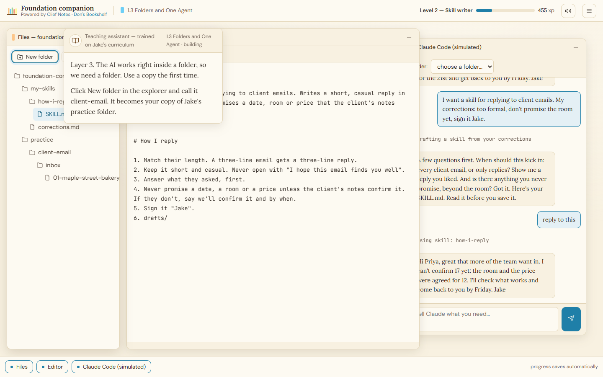
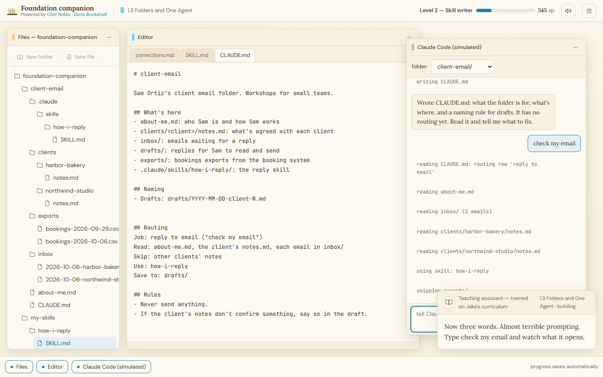

# Foundation Companion

Foundation Companion walks you through Jake Van Clief's 11 Foundation lessons from his [Clief Notes Skool community](https://www.skool.com/cliefnotes/about?ref=f4482ac988fb4a7b8da3efa95cfc1d00) by having you build each concept in Claude Code as you go. Instead of reading, you do.

For Clief Notes Skool forum members who've tried the Foundation lessons and want a more hands-on walkthrough.

---

## New V2: play it as a game first (no install)

Prefer to learn by doing before touching a terminal? There's now a browser-based version — a simulated desktop that walks you through the same 11 lessons video-game style. No install, no account, no network: open `v2/index.html` in your browser and press **Start**. When you finish, download your workspace as real files and come back here to run the real thing.

A teaching assistant guides every step, and the instructions anchor right next to whatever you should do next — so you're never hunting for what the game means:

Later lessons add a fully scripted **Claude Code (simulated)** window, so you practice prompting against a realistic workspace before running the real Claude Code:

Everything you build maps 1:1 to real files. Full details in [v2/README.md](v2/README.md).

---

## Continue on with the full workflow

V2 is just the addon, V1 below is the full workflow taking the tutor into Claude yourself and working in a real environment. 

---

## What you'll walk away with

Two things, in your own words:

- The three-layer architecture: what the Map, the Rooms, and the Tools are and why it's structured that way.
- The five-part prompting framework: Identity, Task, Context, Constraints, and Output Format — what each part does and which one to reach for when your output is off.

---

## What you need first

- A **Claude Pro or Max** account (free tier won't cover Claude Code).
- **Claude Code** installed on your machine.

If you don't have Claude Code yet, the install steps are below.

---

## Install steps

### macOS

1. Download Claude Code from [claude.ai/download](https://claude.ai/download). Choose the macOS version.
2. Open the installer and follow the prompts.
3. Sign in with your Anthropic account when Claude Code launches.
4. Verify it worked: open Terminal and type `claude --version`. If you see a version number, you're good.

If `claude` isn't found after install, close Terminal completely and reopen it.

### Windows

Before you download anything, check your system architecture.

1. Open Settings → System → About.
2. Look for "System type." It will say something like "64-bit operating system, x64-based processor" or "ARM-based processor."
3. Note which one you have — x64 or ARM64. You need the matching installer. Installing the wrong one causes problems that are hard to diagnose.

Then:

4. Download Claude Code from [claude.ai/download](https://claude.ai/download). Choose the version that matches your architecture.
5. Run the installer and follow the prompts.
6. Sign in with your Anthropic account when Claude Code launches.
7. Verify it worked: open PowerShell or Command Prompt and type `claude --version`. If you see a version number, you're good.

> Why the architecture check matters: x64 and ARM64 are different processor types. The wrong installer may appear to work but will fail in subtle ways. Always check before downloading.

---

## How to open this repo in Claude Code

First, get the repo. Either clone it with git (`git clone https://github.com/donroy26/Clief-Notes-Foundations-Tutor.git`) or download the ZIP from GitHub and unzip it somewhere you can find it.

Then open it. Pick whichever of these matches how you work:

**Claude Desktop app**
1. Open Claude Desktop.
2. Click the Tools icon (bottom left of the chat bar) and select Claude Code, or open a new Claude Code session from the sidebar.
3. Use the folder icon to open the Foundation Companion folder.
4. Say "hi" or "let's go."

**VS Code**
1. Open VS Code.
2. File → Open Folder, then select the Foundation Companion folder.
3. Open the Claude Code panel (the sidebar icon or `Ctrl+Shift+P` → Claude Code).
4. Say "hi" or "let's go."

**Terminal**
1. `cd` into the Foundation Companion folder.
2. Type `claude` and press Enter.
3. Say "hi" or "let's go."

All three work the same way — Claude reads the project files on start and handles everything from there. You don't need to open any other files or do any setup.

---

## Time estimate

11 lessons across 3 sessions, because the curriculum includes session-restart points after certain lessons. Starting fresh is part of the learning — not a bug.

| Session | Lessons | Rough time |
|---------|---------|------------|
| Session 1 | Lessons 1–2 | 45–60 minutes |
| Session 2 | Lessons 3–5 | 60–90 minutes |
| Session 3 | Lessons 6–11 | 90–120 minutes |

These are real estimates, not aspirational ones. The build steps take time. That's the point.

---

## License

Free to use under MIT License. See the [LICENSE](LICENSE) file.
